# TDSE_Regression_And_Cloud

**Created by**
Juan Carlos Leal Cruz 

## Laboratory Description
This laboratory focuses on modeling stellar luminosity using linear and polynomial regression implemented from scratch, without relying on machine learning libraries. The main goal is to understand how the hypothesis function, the loss function, and the optimization process are defined, applying all these concepts to a dataset of stellar luminosities.

This project is part of a Machine Learning bootcamp, with an emphasis on learning the fundamentals of models and their execution in cloud and enterprise environments.

### Prerequisites

To run this laboratory you will need:

- Python 3.8 or higher (As a recomendation, the newer versions are better due to the compatibility with the creations of virtual environments in multiple IDEs)
- Jupyter Notebook or JupyterLab
- The following Python libraries:
  - ``numpy``
  - ``matplotlib``
 
### Execution
To run this laboratory, follow the steps below:

1. Clone the repository and navigate to the folder:
   ```
   git clone <Repository_URL>
   cd <Repository_name>
   ```

2. Setup the virtual environment
   ```
   python -m venv venv
   source venv/bin/activate       # On Linux/Mac
   venv\Scripts\activate          # On Windows
   ```

3. Start running each block of code so you can see the results
___

### Ejercicio 1
This notebook implements linear regression from scratch to model stellar luminosity as a function of stellar mass. It covers dataset visualization, model definition, MSE loss, gradient computation, and both iterative and vectorized gradient descent.


### Ejercicio 2
This notebook models nonlinear and interaction effects using polynomial features of mass and temperature. It implements vectorized gradient descent, compares models with different feature sets, evaluates the importance of the interaction term, and demonstrates prediction for a new star.


### AWS SageMaker Execution Evidence
The main goal of this section is to upload both of the Jupyter Notebooks we already created to the AWS SageMaker domain that was stablished in class. In order to do the so, we'll use the Code Editor environment following these steps:

1. Open AWS Academy and look for the lab created by the teacher. Once it has been located, start the lab and access AWS.
2. Inside AWS use the search bar in order to find SageMaker Studio (Select the one that says AI). After that select the option Domains in the side bar and click the Open Studio button so you can access SageMaker; if done correctly, you''l see the next page:
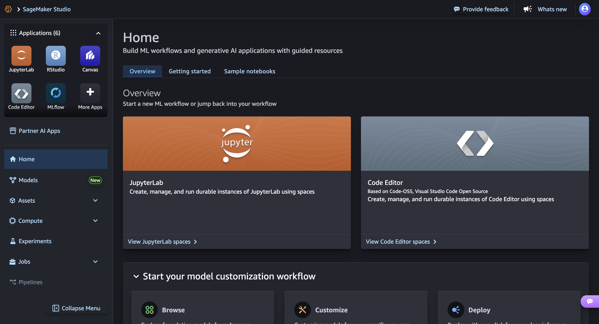

3. Inside SageMaker click the Code Editor App and create a new space.
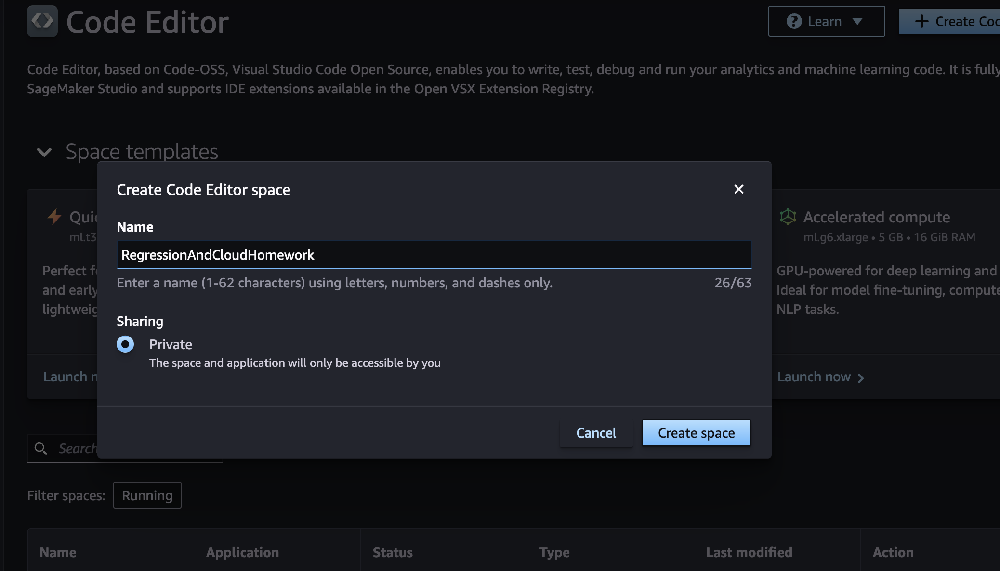

4. Later on, when the Code Editor space is created, click the run button and wait for it to start.
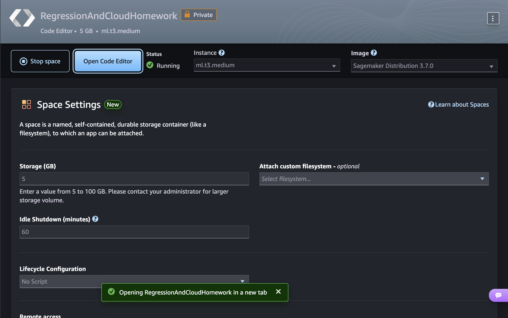

5. Once the space is running, select the Open Code Editor option, so you can access the environment in which the Jupyter Notebooks will be uploaded. At first, it will take a while for the Code Editor to open in the new tab, but at the end you'll see the next page:
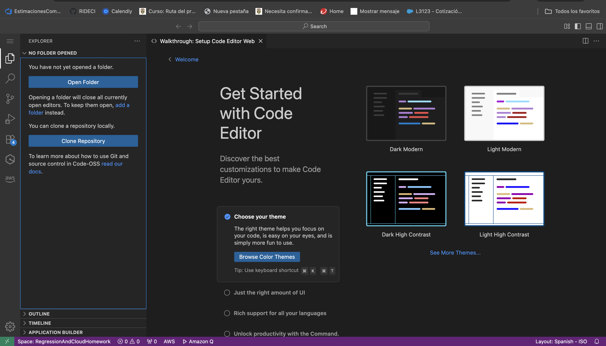

6. Inside the editor, the resemblance with Visual Studio Code will help in the following steps. Select the Open Folder option and select ``/home/sagemaker-user``folder so you can start uploading the files.

7. After the folder is open, drag both Jupyter Notebooks to the side bar.
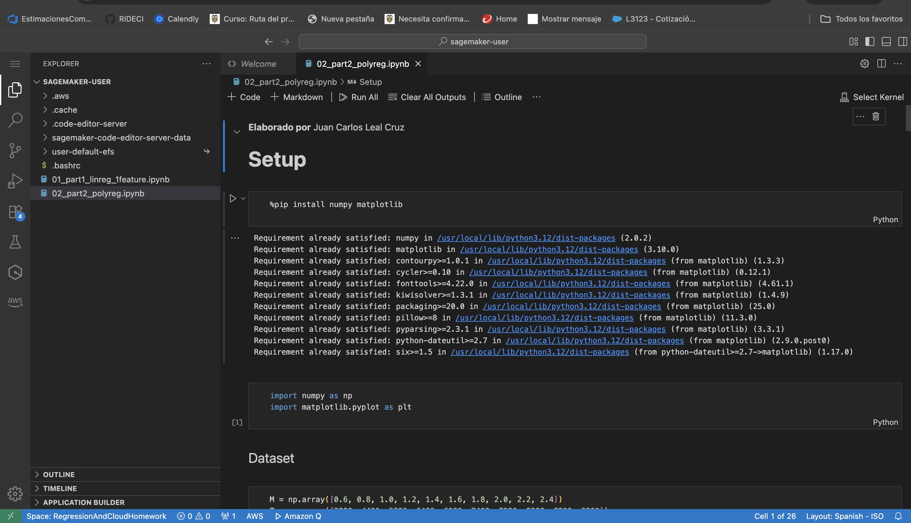

8. Then, choose the Select Kernel button so you can create a Virtual Environment to run the ``.ipynb``files. In this case, select the option that is recommended by the Code Editor.
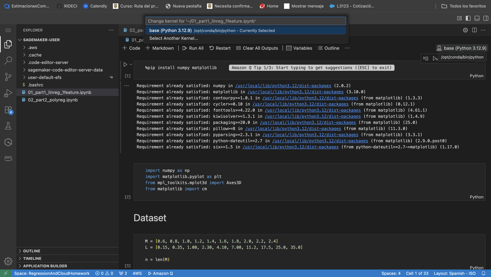

9. When the Kernel is selected, click the Run All button in both Notebooks to execute all code cells.
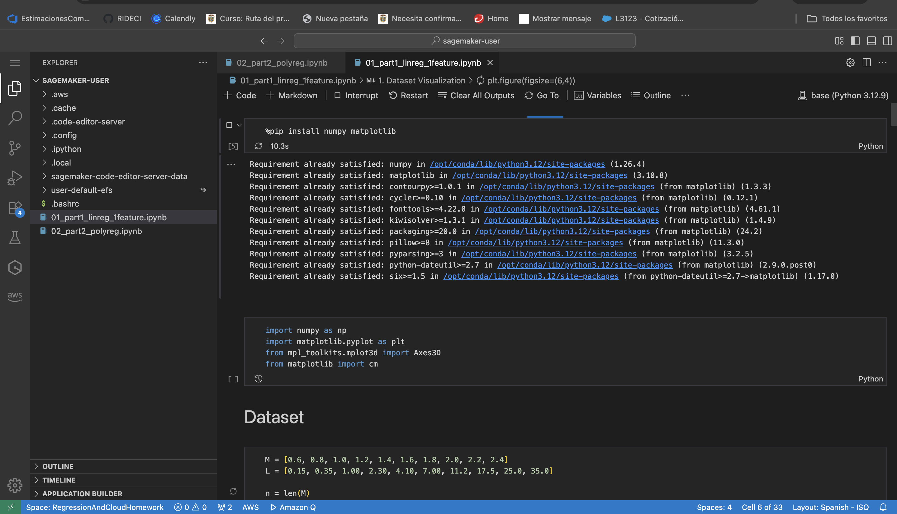

10. After the exectution is complete, verify that there's no error in any of the cells. If there's no error, then the process was completed successfuly. As the Lab requires here is the evidence of two plots, one for each notebook.
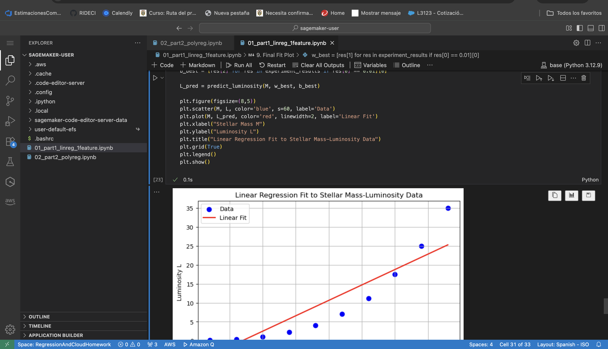
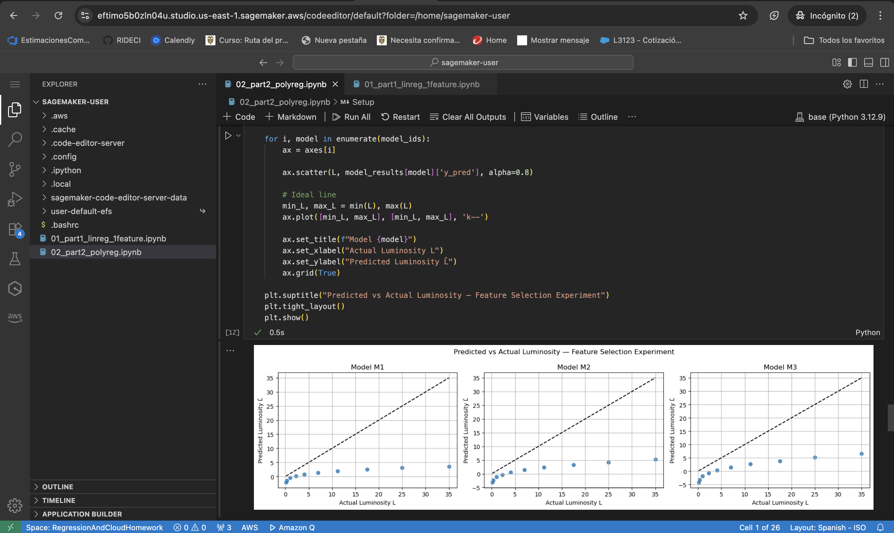

11. Later, save the changes made an close the Code Editor tab so you can return to SageMaker and stop the CodeEditor space environment. After checking that the space has stopped running, you cna close the SageMaker tab and log out from AWS.
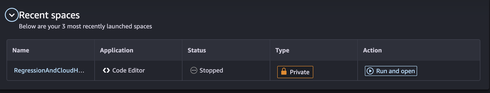

12. Return to the AWS Academy tab and stop the lab.
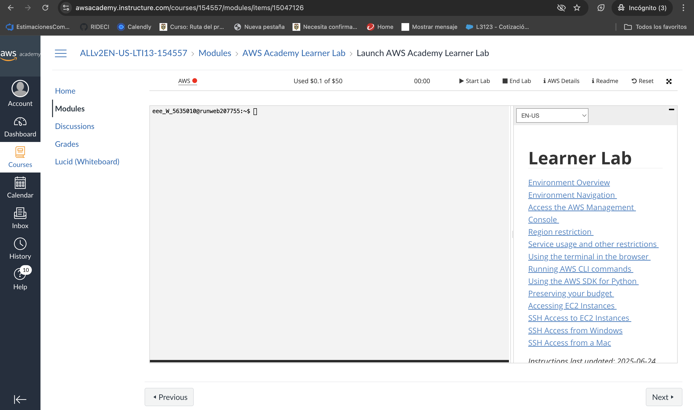

13. Finally, you can Log Out from AWS Acadamy and close all tabs.

**Local Execution vs AWS Execution**

The notebooks executed successfully in both local and AWS SageMaker environments with identical results and visual outputs. No code changes were required. The only difference observed was slightly longer execution time in SageMaker due to the cloud-based execution environment.

